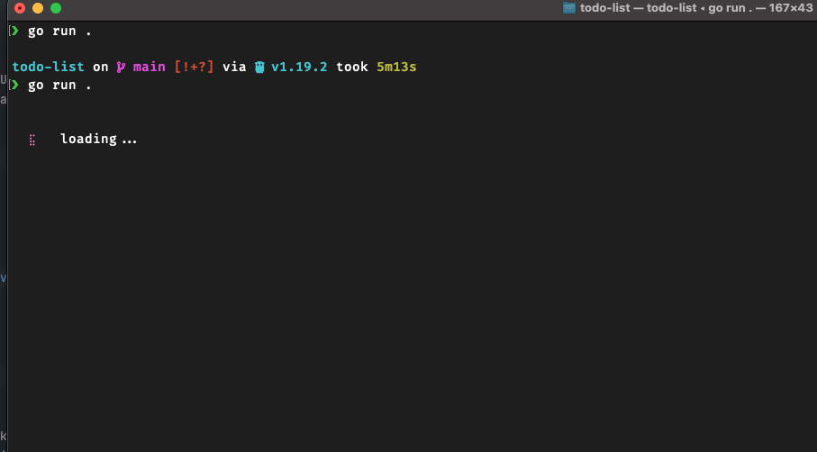
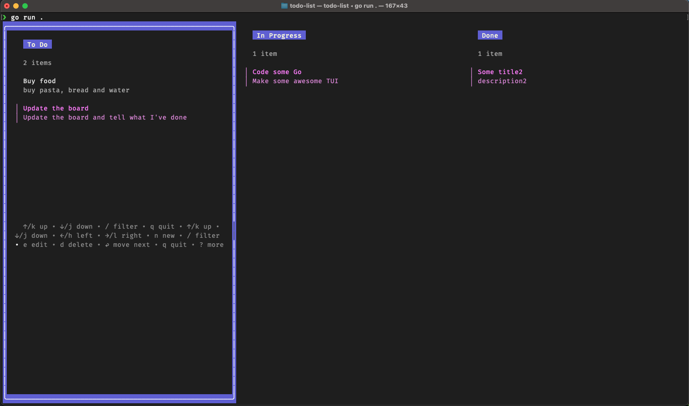
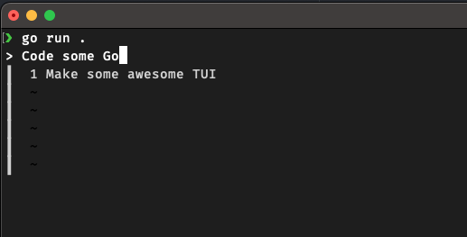

# todo-list
Todo-list made in a cli with Go cli framework [Charm.sh](https://charm.sh/) (bubbletea)
## Running the project 

Before starting, provide a MongoDB URL in the .env file, 
the same way it is shown in .env.example 

```bash
go get
go run .
```

## Demo video
Showing all CRUD operations


## Printscreens
The laoding view:


The main view:


The edit view:



## Highlevel
### Future considerations.
Maybe instead of in every action making MongoDB operations 
I could at the end when the user exits I could save the state.
If we have more users seeing the board what we have today is ideal.
