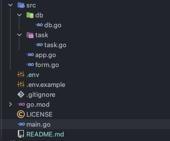
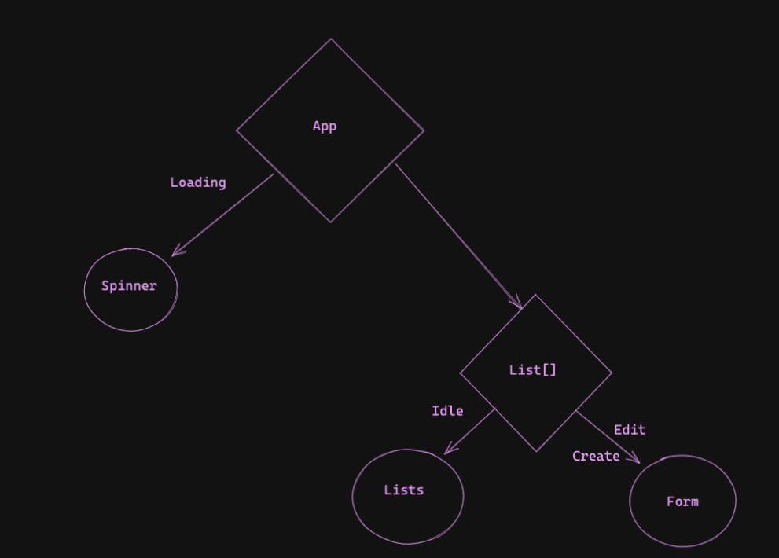

# todo-list

Todo-list made in bubbletea a Go cli framework [Charm.sh](https://charm.sh/)

Most of this code came from this [playlist](https://youtu.be/ZA93qgdLUzM) made
by [@bashbunni](https://github.com/bashbunni).

Added support to MongoDB and broke in more files in order to easier add more features.

## Running the project

Before starting, provide a MongoDB URL in the .env file,
the same way it is shown in .env.example

```bash
go get
go run .
```

## Print screens

The laoding view:


The main view:


The edit/add view:


## High level architecture



We have a main.go file where the main function of our cli runs.
It creates the app(calling the app.go) which while has the loading state shows the Spinner.
When it is not loading no more, it uses the List struct to decide if shows the Lists or the form depending on the state.

The state machine can be explained through this state machine bellow:



### The Database

Starting from the DB and going towards the views, we have a db.go file where we make the abstractions
to work with MongoDB. For example, we have some functions such as ``TaskCollection``, ``InsertTask``
, ``GetTasksByColumn``

The later one is a wonderful one to explain how we work with MongoDB and Go:

```go
package db

func GetTasksByColumn(status task.Column) []list.Item {
	if db == nil {
		log.Fatal("You must call connect before getting collections")
	}
	type thisTask struct {
		ID          string `bson:"_id"`
		Index       int
		Status      task.Column
		Title       string
		Description string
	}
	var _tasks []thisTask
	opts := options.Find().SetSort(bson.D{{"index", 1}})
	cursor, err := TaskCollection().Find(context.TODO(), bson.D{{"status", status}}, opts)
	if err != nil {
		log.Fatal(err)
	}
	err = cursor.All(context.TODO(), &_tasks)
	if err != nil {
		log.Fatal(err)
	}

	tasks := make([]list.Item, len(_tasks))

	for i, _t := range _tasks {
		_id, err := primitive.ObjectIDFromHex(_t.ID)
		if err != nil {
			fmt.Println("Err:", err)
		}
		tasks[i] = task.NewWithIndex(_t.Status, _t.Title, _t.Description, _t.Index, _id)
	}

	return tasks
}

```

Go is a simple language and its simplicity can be shown in this snippet(I'm not a go developer, but I can see its
beauty).
The only "strange" thing we have to do is to create a struct with var and then pass its reference to this struct to a
cursor function and then I can create the tasks that will be shown in the UI.
it is strange, but I need to do this in order to create ready to use in UI structs.

### Form

The form, tho it may seem as a hard thing to be done, if you follow bubbletea tutorials/examples, things get easier.
A unique thing that is done here that is not that normal to be done is how we change the UI when we end edit/creating
the task.
This is done by the switch flow that exists on the ``Update`` method in form.go and app.go, using the types of the
structs in order to get this flow going.


> Looks weird but it works and feels nice. Is a nice abstraction, it brings simplicity in order to create and update UIs

### Task

The task.go file contains the Task struct, in react terms, would be the TaskComponent, contains the Model for
representing it in the UI.

It is a full exported module, that is being used in the app.go

### _The App_

This is the main part of the application, where it controls other modules such as the loading state, columns and forms.
It initiates the DB and gather the documents from the collection.

This file could be called as orchestrator, because it controls other modules and makes the keybindings possible to move
around the tasks,
the ``Update`` function maybe a little chaotic,
but I can assure to you that it has some kind of organization


## Demo video

Showing all CRUD operations

> Started deleting old documents from DB

> Created some task

> Edit its collumn

https://user-images.githubusercontent.com/70247653/204107649-d00a7a3c-4555-4d59-88cd-361033f822db.mov


### Future considerations.

Maybe instead of in every action making MongoDB operations
I could at the end when the user exits I could save the state.
If we have more users seeing the board what we have today is ideal.
